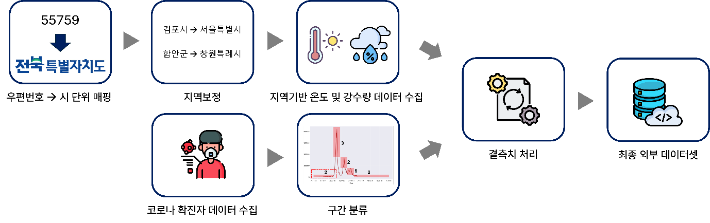
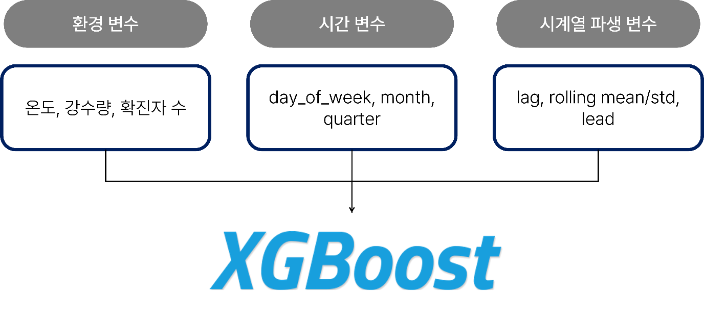
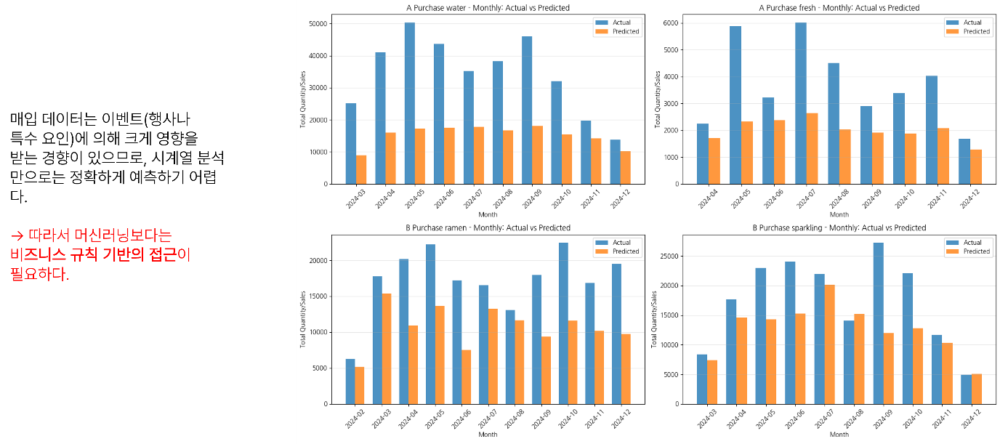
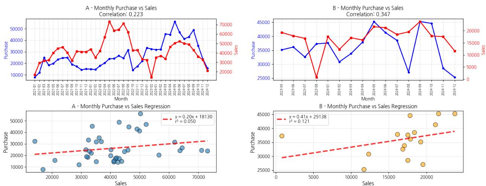
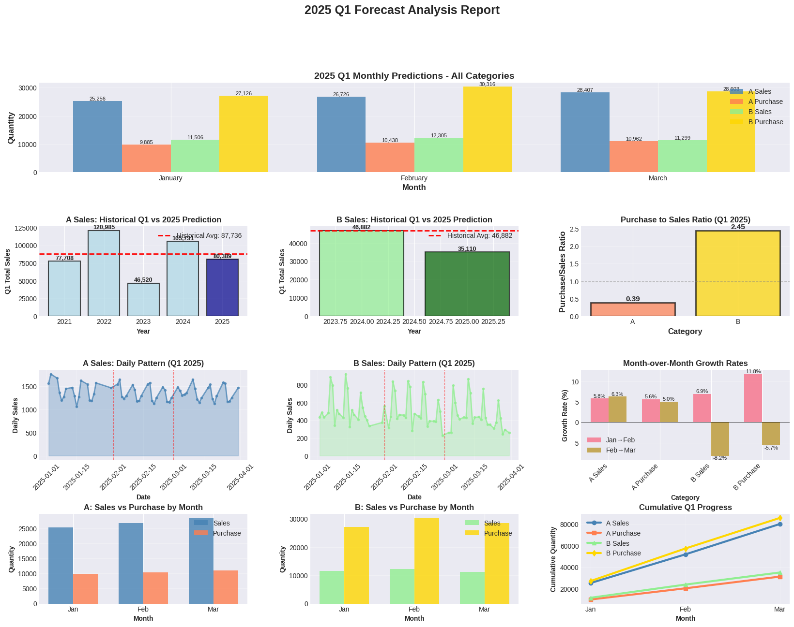
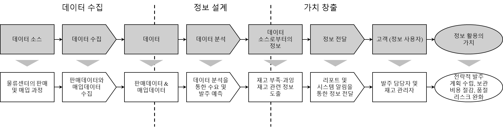

# 2-Stage Prediction Framework: SCM 관점에서의 앙상블 기반 매출·매입 예측
[제4회 유통데이터 활용 경진대회 | 수요예측 부문]

팀 명: move&move

> ## 분석개요
본 분석의 목적은 도매공급망(SCM)에서 매출 및 매입 데이터를 동시에 예측하여 재고·발주 효율을 극대화하는 것이다. 중소유통 물류센터의 경우, 매출 변동에 따라 적절한 매입량을 결정하는 것이 핵심 과제이나, 기존의 단일 예측 모델은 매입과 매출 간의 연계 관계를 충분히 반영하지 못해 예측 오차가 크게 발생한다.
이를 해결하기 위해 본 연구에서는 매출 예측 결과를 기반으로 매입량을 추정하는 2단계(2-Stage) 하이브리드 예측 프레임워크를 제안하였다.
1단계에서는 XGBoost와 Random Forest 앙상블을 활용하여 매출을 예측하고,
2단계에서는 예측된 매출 결과와 매입/매출 비율(Ratio) 변수, 시계열·환경 요인(온도, 강수량, 공휴일, 코로나 등)을 결합하여 매입량을 예측하였다.
이 과정을 통해 매출과 매입의 구조적 관계를 반영하면서도, 비정상 구간이나 변동성이 큰 시기에서도 안정적인 예측을 수행할 수 있었다. 최종적으로 본 분석은 정확한 수요예측을 통해 공급망의 채찍효과(Bullwhip Effect)를 완화하고, 도매 물류센터의 재고관리 및 발주 의사결정 효율을 향상시키는 것을 목표로 한다.

> ## 분석 방법 및 절차
### 1. 데이터 전처리

* 순서
    - 내부 데이터
        1) 기본 정제 및 분류키 생성
        2) 용기류(락앤락, 밀폐용기 등) 상품을 별도로 구분
        3) 분류 정보(대·중·소분류) 와 바코드(barcode) 결측치를 보완
        4) 등장빈도(frequency) 와 순도(purity) 를 활용해 중분류와 소분류를 자동으로 매핑
        5) 브랜드 접두사 기반 보정(Brand Prefix Refinement) 을 적용

        

        6) 미분류 데이터 처리
    - 외부 데이터
        1) 온도 및 강수량 데이터
        2) 평일·주말·공휴일 데이터
        3) 코로나19 확진자 수 데이터
### 2. 정확도 측정 지표
1. R² (Coefficient of Determination)
2. MAPE (Mean Absolute Percentage Error)
3. RMSE (Root Mean Squared Error)
4. MAE (Mean Absolute Error)

### 3. 예측 모델
1. XGBoost

2. Ensemble model $\leftarrow$ XGBoost + Random Forest

3. 비율 기반 예측 모델

“매입은 일반적으로 미래 매출을 기반으로 결정된다”는 비즈니스적 관계에 주목"

(매입 매출간의 관계)

> ## 최종 예측 모델 결과

> ## 활용방안
### 스마트 물류 서비스

