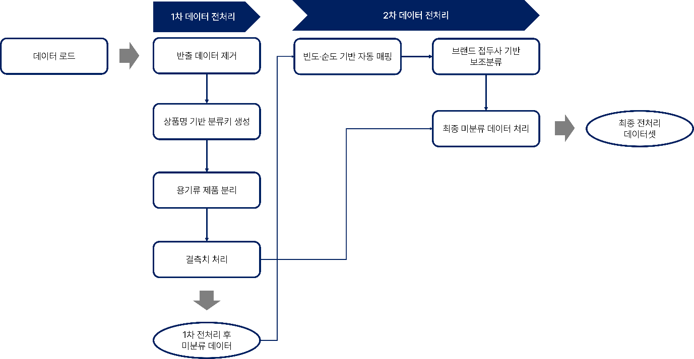
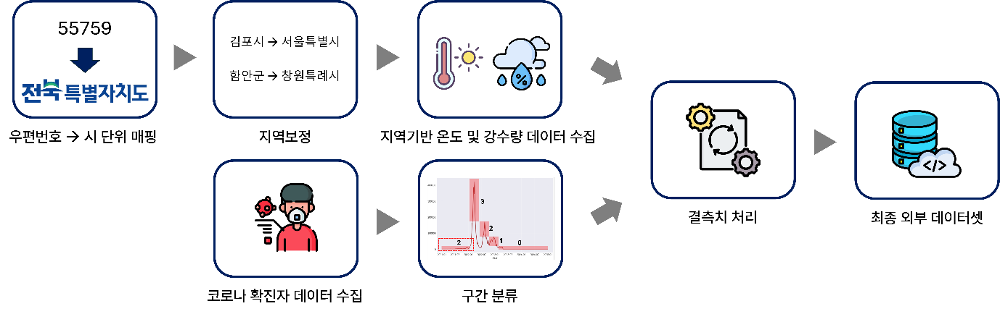
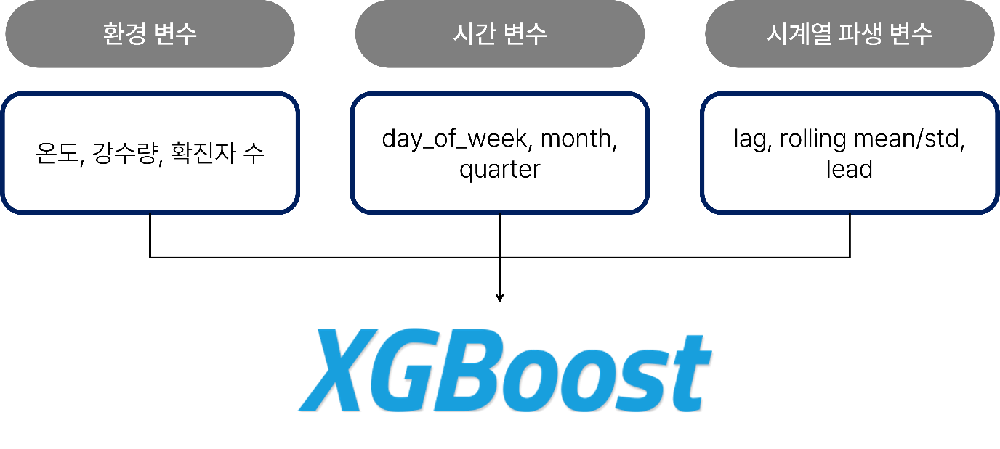
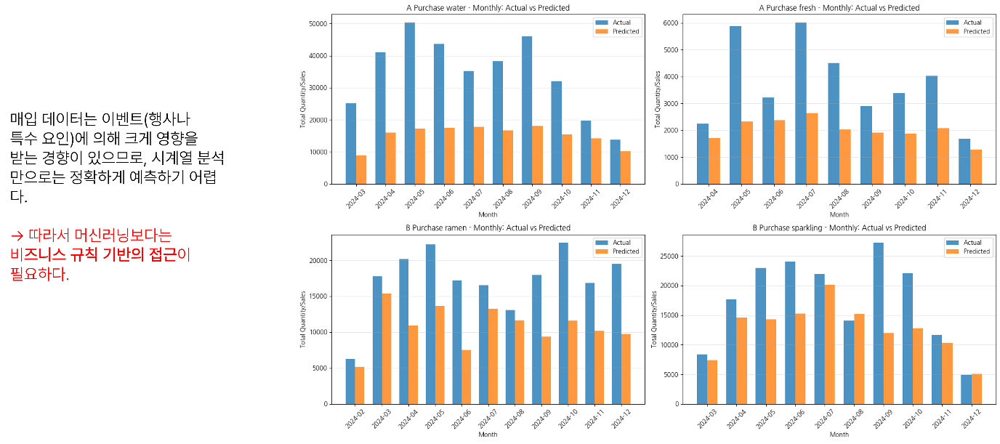
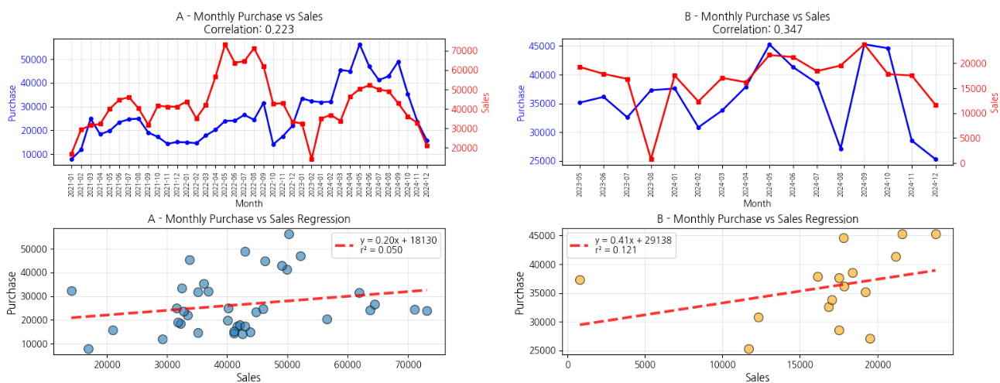
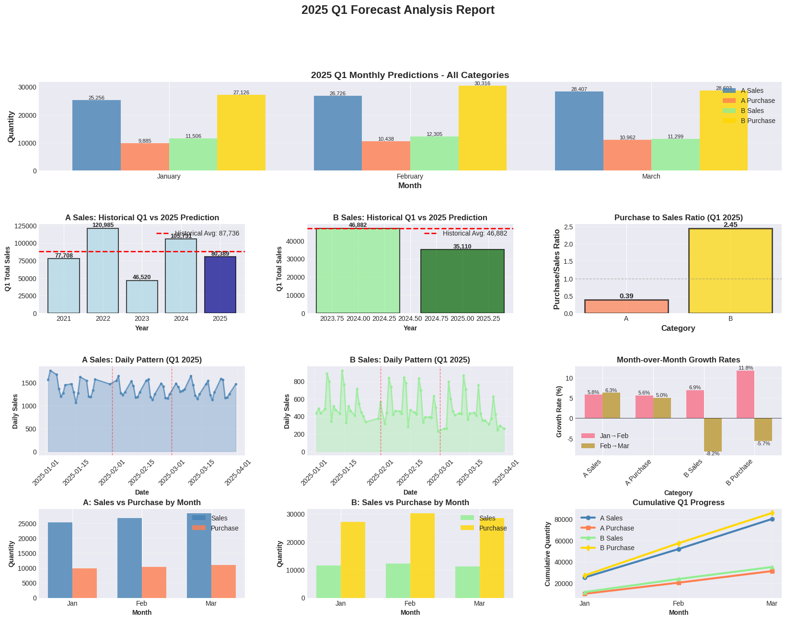
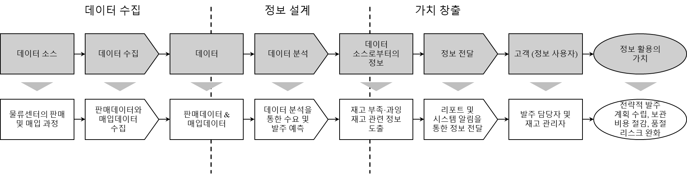

# 2-Stage Prediction Framework  
## SCM 관점에서의 앙상블 기반 매출·매입 예측

**제4회 유통데이터 활용 경진대회 | 수요예측 부문**  
**팀명: move&move**

---

## 1. 분석 개요

본 프로젝트의 목적은 도매공급망(SCM)에서 **매출 및 매입 데이터를 동시에 예측**하여 재고·발주 효율을 극대화하는 것이다.

중소유통 물류센터에서는 매출 변동에 따라 적절한 매입량을 결정하는 것이 핵심 과제이다. 그러나 기존의 단일 예측 모델은 매출과 매입 간의 구조적 관계를 충분히 반영하지 못해 예측 오차가 크게 발생할 수 있다.

이를 해결하기 위해 본 분석에서는 **매출 예측 결과를 기반으로 매입량을 추정하는 2단계(2-Stage) 하이브리드 예측 프레임워크**를 제안하였다.

1. **1단계:** XGBoost와 Random Forest 앙상블을 활용하여 매출 예측  
2. **2단계:** 예측된 매출 결과와 매입/매출 비율 변수, 시계열·환경 요인을 결합하여 매입량 예측

이를 통해 매출과 매입의 관계를 반영하면서도, 변동성이 큰 시기에서도 안정적인 예측을 수행하고자 하였다. 최종적으로는 공급망의 **채찍효과(Bullwhip Effect)**를 완화하고, 도매 물류센터의 재고관리 및 발주 의사결정 효율을 향상시키는 것을 목표로 한다.

---

## 2. 분석 방법 및 절차

### 2.1 데이터 전처리

  

### 처리 순서

#### 내부 데이터

1. 기본 정제 및 분류키 생성
2. 용기류(락앤락, 밀폐용기 등) 상품 별도 구분
3. 분류 정보(대·중·소분류) 및 바코드(barcode) 결측치 보완
4. 등장빈도(frequency)와 순도(purity)를 활용한 중분류·소분류 자동 매핑
5. 브랜드 접두사 기반 보정(Brand Prefix Refinement) 적용
6. 미분류 데이터 처리

  

#### 외부 데이터

1. 온도 및 강수량 데이터
2. 평일·주말·공휴일 데이터
3. 코로나19 확진자 수 데이터

---

## 3. 정확도 측정 지표

모델의 예측 성능은 다음 지표를 기준으로 평가하였다.

| 지표 | 설명 |
|---|---|
| R² | 실제값 대비 예측값의 설명력 |
| MAPE | 실제값 대비 예측 오차의 비율 |
| RMSE | 큰 오차에 민감한 평균 제곱근 오차 |
| MAE | 예측값과 실제값 간 평균 절대 오차 |

---

## 4. 예측 모델

### 4.1 XGBoost

XGBoost는 비선형 관계와 변수 간 상호작용을 효과적으로 반영할 수 있는 Gradient Boosting 기반 모델이다.  
본 분석에서는 매출 및 매입 예측을 위한 주요 기본 모델로 활용하였다.

  

---

### 4.2 Ensemble Model

단일 모델의 한계를 보완하기 위해 **XGBoost와 Random Forest를 결합한 앙상블 모델**을 구성하였다.

  

---

### 4.3 비율 기반 예측 모델

본 분석에서는 “매입은 일반적으로 미래 매출을 기반으로 결정된다”는 비즈니스적 관계에 주목하였다.

이에 따라 예측된 매출값과 매입/매출 비율 변수를 활용하여 매입량을 추정하는 비율 기반 예측 모델을 설계하였다.

  

---

## 5. 최종 예측 모델 결과

최종 모델은 매출 예측 결과와 외부 요인, 매입/매출 비율 변수를 함께 반영하여 매입량을 예측하였다.

  

---

## 6. 활용 방안

### 스마트 물류 서비스

본 분석 결과는 도매 물류센터의 발주량 예측, 재고관리, 물류 운영 최적화에 활용될 수 있다.  
특히 매출 변동에 따른 매입량을 사전에 예측함으로써 과잉 재고와 재고 부족 문제를 완화할 수 있다.

  

---

## 7. 기대 효과

본 프로젝트를 통해 다음과 같은 효과를 기대할 수 있다.

1. 매출 기반 매입량 예측을 통한 발주 의사결정 지원
2. 재고 부족 및 과잉 재고 문제 완화
3. 공급망 내 채찍효과(Bullwhip Effect) 감소
4. 외부 환경 요인을 반영한 수요예측 정확도 향상
5. 중소유통 물류센터의 스마트 물류 운영 기반 마련
